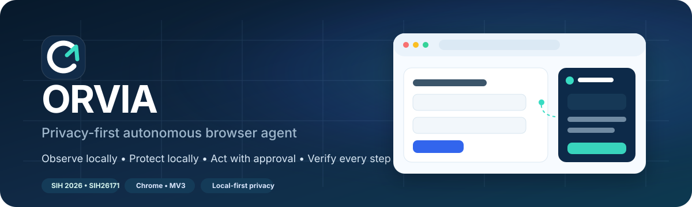
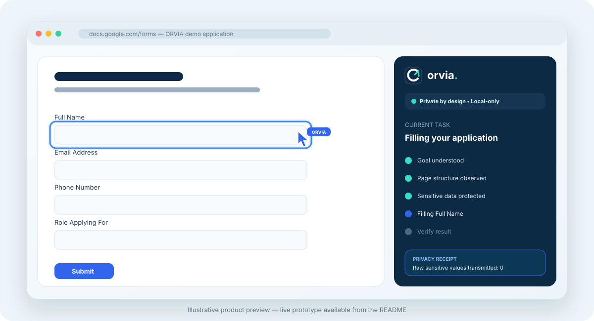

# ORVIA — Privacy-First Autonomous Browser Agent

<p align="center">
  
</p>

<p align="center">
  <a href="https://sih26171.vercel.app"></a>
  <a href="https://docs.google.com/forms/d/e/1FAIpQLSedR-mD4dE5RGNd6qQ99itc7I82M_zwpFeM6vTR2UqnVWPykA/viewform?usp=publish-editor"></a>
  <a href="https://github.com/mananbharti/sih26171"></a>
</p>

<p align="center">
  
  
  
  
  
  
  
</p>

> **ORVIA** turns a high-level browser goal into a controlled execution loop: **observe → protect → reason → validate → act → verify** — while keeping sensitive browser context local by default.

Built for **Smart India Hackathon 2026 — SIH26171: On-device Visual Perception for Light-weight Browser Agents**.

---

## Live links

| Resource | Link |
|---|---|
| **Interactive ORVIA prototype** | **https://sih26171.vercel.app** |
| **Google Forms demo target** | **https://docs.google.com/forms/d/e/1FAIpQLSedR-mD4dE5RGNd6qQ99itc7I82M_zwpFeM6vTR2UqnVWPykA/viewform?usp=publish-editor** |
| **Repository** | **https://github.com/mananbharti/sih26171** |

---

## The problem

Browser agents are powerful because they can read pages, reason about tasks, and act on behalf of users. But conventional browser-agent designs can create a serious privacy tradeoff:

- screenshots may contain far more information than a task actually requires;
- forms can contain names, phone numbers, credentials, financial data, and private documents;
- a remote model may receive raw visual or DOM context;
- an incorrect action can change page state before the user understands what happened;
- long-running agents can become difficult to audit.

ORVIA is designed around a different assumption:

> **An agent should first decide what it actually needs to see, protect that context locally, and only then decide what it is allowed to do.**

---

## What ORVIA is

ORVIA is a **privacy-first autonomous browser assistant** delivered as a Chrome side-panel extension plus a standalone interactive web prototype.

The product is intentionally simple on the surface:

- one goal / prompt box;
- clear task progress;
- a privacy status;
- approval only when an action needs it;
- an optional activity view;
- a privacy receipt after execution;
- a final verified result.

Underneath, ORVIA follows a closed-loop agent architecture:

```text
USER GOAL
   ↓
UNDERSTAND
   ↓
PLAN / SUBTASK
   ↓
OBSERVE PAGE
   ↓
MINIMUM REQUIRED PERCEPTION
   ↓
LOCAL PRIVACY PROTECTION
   ↓
EGRESS CHECK
   ↓
REASON / DECIDE
   ↓
LOCAL ACTION VALIDATION
   ↓
EXECUTE
   ↓
OBSERVE RESULT
   ↓
VERIFY
   ├── failure → re-observe / replan
   └── success → next task / complete
```

---

## Product preview

<p align="center">
  
</p>

> The illustration above represents the product interaction model. The live prototype is available at the link above.

---

## Core ideas

### 1. Progressive perception

ORVIA does **not** begin with a full-screen vision request.

The target architecture uses the cheapest sufficient source of context:

```text
DOM / semantics
      ↓
Is structured context enough?
      ├── yes → continue
      └── no
           ↓
      relevant region
           ↓
      OCR / local visual understanding
```

This reduces unnecessary perception work and minimizes the amount of private context that must be processed.

### 2. Local privacy engine

Before context can cross the privacy boundary, ORVIA can:

- detect known sensitive values;
- detect email addresses;
- detect phone numbers;
- detect credential-like patterns;
- identify password-style fields;
- minimize irrelevant page context;
- mask / tokenize sensitive values;
- block unsupported or unsafe actions.

The current prototype implements deterministic privacy rules locally in TypeScript.

### 3. Egress firewall

Redaction is not treated as the final step.

ORVIA performs a **second inspection of the final serialized payload**. If sensitive patterns remain, the prototype fails closed.

Current prototype safeguards include:

- final sensitive-pattern scan;
- context-size limit;
- no external AI network transmission;
- extension-page CSP with `connect-src 'none'`.

### 4. Capability-bound browser actions

The agent does not receive unrestricted browser authority.

Supported form fields are represented using temporary handles and a constrained action set. The action layer validates:

- supported field type;
- supported profile key;
- action length;
- active tab;
- active origin;
- approval freshness.

### 5. Observe → Verify

Browser automation is not considered complete immediately after an action.

The execution loop checks whether the expected page state was retained and can stop safely if the result does not match the plan.

---

## System architecture

```mermaid
flowchart LR
    U["User Goal"] --> UI["ORVIA Sidebar"]

    subgraph CLIENT["Client / Browser"]
      UI --> OBS["Page Observer<br/>DOM • UI semantics • visible state"]
      OBS --> PER["Progressive Perception<br/>structured context first"]
      PER --> PRIV["Local Privacy Engine<br/>detect • minimize • redact"]
      PRIV --> EG["Egress Firewall<br/>final payload inspection"]
    end

    EG --> B["Privacy Boundary<br/>sanitized context only"]

    subgraph AGENT["Agent Core"]
      B --> PLAN["Goal / Task Planner"]
      PLAN --> CTX["Context Builder"]
      CTX --> DECIDE["Reason / Decide"]
      DECIDE --> ACTION["Structured Action Plan"]
    end

    subgraph EXEC["Safe Local Execution"]
      ACTION --> VALID["Action Validator"]
      VALID --> APPROVAL{"Approval needed?"}
      APPROVAL -->|yes| HUMAN["User Approval"]
      HUMAN --> ACT["Browser Executor"]
      APPROVAL -->|no| ACT
      ACT --> VERIFY["Observe + Verify"]
    end

    VERIFY -->|failure| PLAN
    VERIFY -->|updated state| OBS
    VERIFY -->|success| DONE["Next Task / Final Result"]

    MEM["Privacy-safe State / Memory"] -.-> CTX
    PRIV -.-> RECEIPT["Privacy Receipt"]
    VERIFY -.-> AUDIT["Activity / Metrics"]
```



### Current prototype boundary

The repository currently uses a **local deterministic planner** rather than a remote LLM. That is deliberate for the prototype: the privacy and execution mechanics can be demonstrated without sending browser data to an external AI service.

---

## What is real today vs. what is simulated

Transparency matters, especially for a security-focused browser agent.

| Capability | Current prototype status |
|---|---|
| Chrome side-panel extension | ✅ Implemented |
| Manifest V3 extension build | ✅ Implemented |
| Active-page DOM observation | ✅ Implemented |
| Visible text / heading extraction | ✅ Implemented |
| Field discovery and semantic label mapping | ✅ Implemented |
| Google Forms-aware field handling | ✅ Implemented |
| Short answer / paragraph filling | ✅ Implemented |
| Radio / checkbox / multi-checkbox handling | ✅ Implemented |
| Custom dropdown interaction | ✅ Implemented |
| Local email / phone / credential masking | ✅ Implemented |
| Fail-closed egress rescan | ✅ Implemented |
| Local approval before form mutation | ✅ Implemented |
| Time-limited pending approval | ✅ Implemented |
| Page action cursor overlay | ✅ Implemented |
| Blue working border / field highlight | ✅ Implemented |
| Stop / cancellation behavior | ✅ Implemented |
| Privacy receipt | ✅ Implemented |
| Read-only page summarization / extraction demo | ✅ Implemented |
| External cloud LLM reasoning | ❌ Disabled in current prototype |
| Full OCR / VLM perception | 🧪 Represented in the flow; escalation is currently simulated |
| Automatic final form submission | 🚧 Not enabled in the current integrated flow; user reviews and submits manually |
| Production-grade PII classifier | 🚧 Roadmap |

This distinction is intentional: **ORVIA demonstrates real browser observation, local privacy protection, action gating and DOM execution without pretending that unfinished AI components are already production-ready.**

---

## Demo workflow

For the strongest SIH demo, open the supplied Google Form and use a prompt such as:

> **Fill this application using my demo profile. Protect my private information and ask me before making changes.**

The intended interaction is:

1. ORVIA reads the active page.
2. It finds actionable form fields from visible labels and ARIA / DOM semantics.
3. Labels are mapped to profile keys using fuzzy local matching.
4. Sensitive values are protected in the context representation.
5. The final payload is checked by the egress firewall.
6. ORVIA prepares a constrained action plan.
7. The side panel asks for approval.
8. After approval, the content script fills supported fields in sequence.
9. The in-page ORVIA cursor moves to each real DOM target.
10. The active field receives a temporary blue highlight.
11. ORVIA verifies the resulting field values.
12. The user reviews the final page before submission.

---

## Google Forms support

The extension contains dedicated Google Forms logic in:

```text
extension/googleForms.ts
```

It avoids depending only on generated CSS class names and instead prefers semantic signals such as:

- visible question text;
- `role="listbox"`;
- `role="option"`;
- `role="radio"`;
- `role="checkbox"`;
- ARIA attributes;
- nearby labels;
- native input / textarea behavior.

The form mapper supports a synthetic demo profile with keys such as:

```text
fullName
email
phone
college
course
year
role
skills
github
portfolio
resumeLink
coverNote
consent
```

---

## Agent cursor and working-state UX

During live browser interaction, ORVIA injects a non-interactive overlay layer that provides:

- an ORVIA-branded agent pointer;
- smooth cursor travel between targets;
- a blue browser-edge working glow;
- an amber approval state;
- a green / teal success state;
- a red error pulse;
- a temporary target-element outline;
- a lightweight status badge.

The overlay uses `pointer-events: none`, so it does not alter the page layout or steal interactions.

---

## Privacy model

### Local protection pipeline

```text
Observed Page
      ↓
Sensitive Pattern Detection
      ↓
Context Minimization
      ↓
Mask / Tokenize
      ↓
Final Serialized Payload
      ↓
EGRESS FIREWALL
      ↓
Safe Local Context
```

### Deterministic rules currently implemented

The prototype protects:

- known profile values;
- email addresses;
- international / Indian-style phone numbers;
- `password`;
- `passwd`;
- `secret`;
- API-key-like assignments;
- access-token-like assignments.

### Action policy

The prototype whitelists supported browser field types and profile keys.

Examples of allowed field types:

```text
text
email
tel
textarea
short-answer
paragraph
dropdown
radio
checkbox
multi-checkbox
consent
```

Unsafe / unknown field types are blocked rather than guessed.

### Privacy receipt

A completed run can surface:

- detected categories;
- number of protected items;
- number of blocked fields;
- sanitized payload;
- payload size;
- measured local elapsed time;
- network bytes sent by the prototype.

In the current local-only prototype, the receipt records **0 external network bytes for agent reasoning**.

---

## Tech stack

### Implemented in this repository

| Layer | Technology |
|---|---|
| UI | React 19 |
| Language | TypeScript 5.8 |
| Bundler / Dev server | Vite 6 |
| Chrome extension | Manifest V3 |
| Browser APIs | Chrome Extensions API, DOM APIs |
| Extension UI | Chrome Side Panel |
| Extension build | esbuild |
| Icons | Lucide React |
| Privacy | Local TypeScript rules + validators |
| State / approvals | Chrome `storage.session` + React state |
| Testing | Node test runner + Playwright |
| Deployment | Vercel / static Vite build |

### Target research stack

The full SIH architecture is designed to evolve toward:

| Layer | Planned / evaluated technology |
|---|---|
| In-browser acceleration | WebGPU |
| Browser inference | Transformers.js / ONNX Runtime Web |
| Fast local routing | lightweight local classifier |
| OCR | Tesseract.js or optimized local OCR |
| Tiny local vision | SmolVLM-class model |
| Face detection | MediaPipe |
| Backend API | Python + FastAPI |
| Agent orchestration | LangGraph / custom task graph |
| Structured validation | Pydantic / JSON Schema |
| Reasoning model | Qwen3-VL-4B-class local model |
| Local model runtime | Ollama or llama.cpp |
| Persistent state | SQLite |
| Safe graph memory | Graphify-style sanitized graph memory |

> Planned components are listed as **roadmap architecture**, not as features already shipped in the current repository.

---

## Repository structure

```text
sih26171/
├── extension/
│   ├── background.ts        # approval lifecycle + privileged extension actions
│   ├── content.ts           # page observation + local DOM execution
│   ├── googleForms.ts       # Google Forms discovery / mapping / filling
│   └── overlays.ts          # agent cursor, page glow, field highlight
│
├── src/
│   ├── App.tsx              # web demo + extension side-panel interface
│   ├── demo.ts              # controlled web-demo fixture
│   ├── main.tsx
│   ├── privacy.ts           # redaction, egress firewall, action validation
│   ├── profile.ts           # synthetic demo profile + fuzzy label mapping
│   ├── style.css            # product UI
│   └── types.ts             # shared agent / privacy / action types
│
├── public/
│   ├── favicon.svg
│   └── practice.html        # local practice target
│
├── scripts/
│   └── build-extension.mjs  # Chrome extension build pipeline
│
├── tests/
│   ├── browser/
│   │   └── flows.spec.ts    # Playwright product-flow tests
│   └── privacy.test.ts      # privacy / policy unit tests
│
├── docs/
│   ├── readme-hero.svg
│   └── product-preview.svg
│
├── index.html
├── sidepanel.html
├── package.json
├── playwright.config.ts
├── vite.config.ts
├── vercel.json
└── netlify.toml
```

---

## Getting started

### Prerequisites

- **Node.js 20+** recommended
- **npm**
- **Google Chrome 116+** for the extension build

### Install

```bash
git clone https://github.com/mananbharti/sih26171.git
cd sih26171
npm install
```

### Run the web prototype

```bash
npm run dev
```

Vite starts the local app on:

```text
http://127.0.0.1:5173
```

---

## Build the project

```bash
npm run build
```

The build command:

1. runs TypeScript type checking;
2. builds the Vite web app;
3. bundles the Chrome background service worker;
4. bundles the Chrome content script;
5. generates the Manifest V3 file.

The unpacked Chrome extension is created in:

```text
extension-build/
```

---

## Install the Chrome extension

1. Run:

   ```bash
   npm install
   npm run build
   ```

2. Open Chrome:

   ```text
   chrome://extensions
   ```

3. Enable **Developer mode**.

4. Click **Load unpacked**.

5. Select:

   ```text
   extension-build/
   ```

6. Pin ORVIA from the Chrome toolbar.

7. Open a regular HTTPS website or the demo Google Form.

8. Click the ORVIA toolbar icon to open the side panel.

Chrome internal pages such as `chrome://...` are intentionally not valid targets.

---

## Run tests

### Privacy / policy unit tests

```bash
npm test
```

Current tests cover:

- masking known names;
- masking email addresses;
- masking phone numbers;
- masking credential patterns;
- fail-closed egress behavior;
- oversized context rejection;
- unsupported action rejection;
- action length constraints.

### Browser UI tests

Install Playwright browsers once:

```bash
npx playwright install chromium
```

Then run:

```bash
npm run test:ui
```

The browser suite covers:

- application approval;
- privacy receipt masking;
- successful controlled demo completion;
- summarization;
- data extraction;
- JSON export;
- decline behavior;
- cancellation;
- replan simulation;
- DOM fallback simulation;
- mobile layout usability.

---

## Chrome permissions

The generated Manifest V3 extension currently requests:

```json
{
  "permissions": [
    "activeTab",
    "scripting",
    "sidePanel",
    "storage"
  ],
  "host_permissions": [
    "<all_urls>"
  ]
}
```

### Why these permissions exist

- **activeTab** — work with the active page selected by the user;
- **scripting** — inject / ensure the ORVIA content script is available;
- **sidePanel** — provide the ORVIA assistant interface;
- **storage** — hold short-lived approval state;
- **host permissions** — prototype compatibility across demo sites.

> The broad host permission is appropriate for the hackathon prototype but should be narrowed or switched to more explicit site-access controls before production distribution.

---

## Safety properties in the current prototype

ORVIA is intentionally conservative.

- Unknown action types are rejected.
- Password / credential-style targets are excluded.
- Action plans are limited to supported profile keys.
- Pending approvals expire.
- Approval is tied to the same active tab and origin.
- A changed active page causes execution to stop.
- The user can cancel an active run.
- The extension does not send page context to a cloud AI service.
- The egress firewall blocks unmasked email / credential patterns.
- Oversized contexts are rejected.
- The extension page CSP disables outgoing network connections.

---

## SIH evaluation alignment

ORVIA's architecture is designed around the official SIH26171 evaluation dimensions:

| Evaluation dimension | Weight | ORVIA design response |
|---|---:|---|
| Visual context accuracy | **25%** | Progressive perception + semantic page observation + ROI-first escalation |
| PII detection precision / recall | **20%** | Multi-layer local sensitive-data detection |
| Redaction precision | **20%** | Local masking / tokenization + second-pass egress firewall |
| Client resource utilization | **20%** | DOM-first pipeline; visual processing only when necessary |
| End-to-end latency | **15%** | Event-driven observation, minimal context, local validation |

No benchmark number is claimed in this README unless it has actually been measured.

---

## Why this approach is different

Many browser-agent prototypes focus almost entirely on **how much the agent can see**.

ORVIA focuses on a different question:

> **How little does the agent need to see to complete the task safely?**

That changes the architecture:

```text
Traditional approach:
Screenshot → Remote model → Action

ORVIA:
Goal
→ Structured observation
→ Minimum required perception
→ Local privacy protection
→ Sanitized context
→ Structured action
→ Local validation
→ Execution
→ Verification
```

---

## Roadmap

### Stage 1 — deterministic privacy + safe execution ✅

- Chrome side-panel prototype
- DOM observation
- form mapping
- local privacy rules
- egress firewall
- approval-gated field filling
- agent cursor / working overlay
- privacy receipt
- web demo
- automated tests

### Stage 2 — progressive local perception

- WebGPU capability detection
- OCR escalation
- relevant-region selection
- tiny local VLM evaluation
- local face / visual-sensitive-data detection
- perception confidence and fallback logic

### Stage 3 — goal-driven agent core

- dynamic subtask graph
- structured planner
- local / LAN reasoning service
- capability-bound element handles
- action-risk classification
- explicit approval for sensitive submit / upload actions
- re-observe / retry / replan loop

### Stage 4 — privacy-safe memory + benchmarks

- sanitized session memory
- safe long-term relationship graph
- privacy receipt history
- stage-level latency measurement
- CPU / memory / GPU resource telemetry
- Always-Vision vs Progressive-Perception ablation benchmark

---

## Prototype limitations

This repository is a **hackathon prototype**, not a production browser-security product.

Important limitations:

- deterministic rules are not a complete PII detector;
- OCR and visual perception escalation are not yet fully integrated;
- the current planner is deterministic / local rather than a general LLM agent;
- site-specific DOM behavior can change;
- Google Forms markup may evolve;
- broad host permissions should be tightened for production;
- final submission is intentionally not performed automatically by the currently integrated flow;
- the system has not undergone an external security audit.

---

## Demo prompt

A useful demonstration prompt is:

```text
Fill this application using my demo profile.
Protect my private information and ask me before making changes.
```

Then watch ORVIA move through:

```text
Observe
→ Perceive
→ Protect
→ Validate
→ Act
→ Verify
```

---

## Design principles

ORVIA is built around five principles:

1. **Privacy before reasoning** — sensitive context is handled locally first.
2. **Minimum necessary perception** — do not analyze pixels when structured context is sufficient.
3. **No blind execution** — actions are constrained and validated.
4. **Human control at sensitive boundaries** — approvals are explicit.
5. **Verify, don't assume** — the browser state is checked after actions.

---

## Team

**Team ECHO**  
Smart India Hackathon 2026

Project: **ORVIA — On-device Real-time Visual Intelligence Agent**

---

## Acknowledgement

ORVIA is being developed as a prototype for **SIH26171** and is focused on exploring safer, privacy-preserving browser-agent architecture.

If you are evaluating the project, start with the **live interactive demo**, then inspect the **privacy pipeline**, **extension execution code**, and **tests** in this repository.

<p align="center">
  <strong>See locally. Protect locally. Act safely.</strong>
</p>
